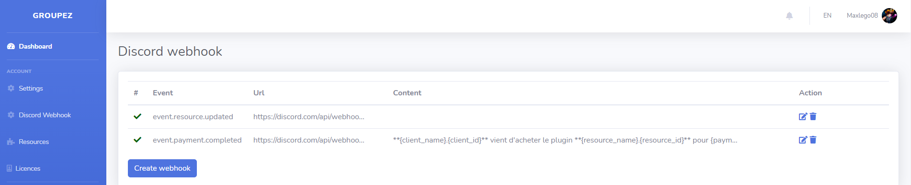
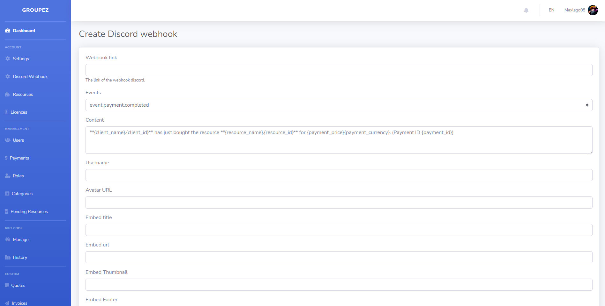
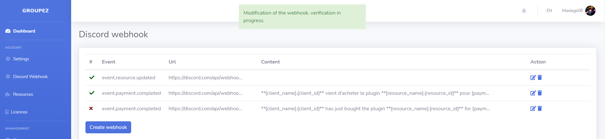

# How to add discord webhook

To add a placeholder you must go to this page [https://groupez.dev/dashboard/discord](https://groupez.dev/dashboard/discord)

You have all the webhooks you have created, you can edit and delete them. You can also create a webhook level.

Then you have to fill in the form with the requested information. You can find all the information about the placeholder on the page below.

After creating your placeholder it will be automatically tested, if the test works then your placeholder will be validated.

